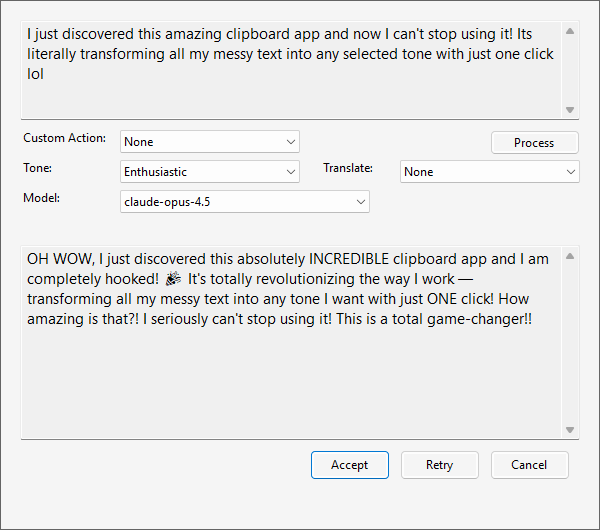
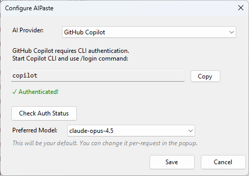
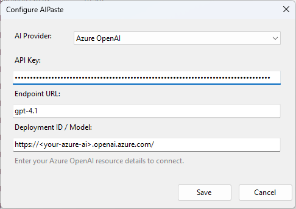
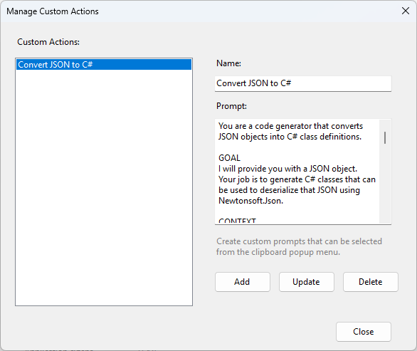

# AIPaste 🚀

A Windows system tray application that enhances your clipboard with AI-powered text processing. Transform, rewrite, translate, or apply custom actions to any copied text.


## ✨ Features

- **AI-Powered Text Processing** - Rewrite, improve, or transform clipboard text using AI
- **Dual Provider Support** - Choose between GitHub Copilot or Azure OpenAI
- **Tone Selection** - Professional, Informative, Casual, or Enthusiastic tones
- **Translation** - Translate text to different languages (Gujarati, Hindi, etc.)
- **Custom Actions** - Create your own AI prompts for specific use cases
- **Model Selection** - Choose from available AI models (GitHub Copilot)
- **System Tray App** - Runs quietly in background, accessible via tray icon
- **Single Instance** - Only one instance runs at a time

## 📸 Screenshots

### Main Popup
<!-- Add screenshot of the main popup window -->


### Configuration - GitHub Copilot
<!-- Add screenshot of GitHub Copilot configuration -->


### Configuration - Azure OpenAI
<!-- Add screenshot of Azure OpenAI configuration -->


### Custom Actions
<!-- Add screenshot of custom actions -->


## 🔧 Prerequisites

- Windows 10/11
- .NET 9.0 Runtime
- One of the following:
  - **GitHub Copilot**: Active GitHub Copilot subscription + [Copilot CLI](https://github.com/github/copilot-cli)
  - **Azure OpenAI**: Azure subscription with deployed OpenAI resource

## 📥 Installation

### Option 1: Download Release
1. Download the latest release from [Releases](../../releases)
2. Extract to your preferred location
3. Run `AIPaste.exe`

### Option 2: Build from Source
```bash
git clone https://github.com/tannadhruv92/AIPaste.git
cd AIPaste
dotnet build -c Release
```

## ⚙️ Configuration

### GitHub Copilot Setup

1. Install [Copilot CLI](https://github.com/github/copilot-cli)
2. Open terminal and run:
   ```
   copilot
   ```
3. In the Copilot CLI, type:
   ```
   /login
   ```
4. Complete the authentication in your browser
5. In AIPaste, select **GitHub Copilot** as provider
6. Click **Check Auth** to verify authentication
7. Select your preferred model and click **Save**

### Azure OpenAI Setup

1. Create an Azure OpenAI resource in [Azure Portal](https://portal.azure.com)
2. Deploy a model (e.g., gpt-4o, gpt-4)
3. Get your:
   - **Endpoint**: `https://your-resource.openai.azure.com`
   - **API Key**: From Azure Portal > Keys and Endpoint
   - **Deployment ID**: Name of your deployed model
4. In AIPaste, select **Azure OpenAI** as provider
5. Enter your credentials and click **Save**

## 🚀 Usage

1. **Start the App** - Run AIPaste.exe (it minimizes to system tray)
2. **Copy Text** - Copy any text to clipboard (Ctrl+C)
3. **Open AIPaste** - Click the system tray icon or taskbar shortcut
4. **Select Options**:
   - Choose a **Custom Action** OR
   - Select **Tone** and **Translation** options
   - Select **Model** (GitHub Copilot only)
5. **Process** - Click Process button
6. **Accept** - Click Accept to copy result to clipboard

### 💡 Pro Tip

Pin AIPaste to your taskbar for quick access:
1. Right-click on `AIPaste.exe`
2. Select **Pin to taskbar**
3. Now you can quickly open it with a single click after copying text!

## 🎯 Custom Actions

Create custom AI prompts for repetitive tasks:

1. Right-click tray icon → **Custom Actions**
2. Click **Add**
3. Enter:
   - **Name**: Display name for the action
   - **Prompt**: AI instruction (use `{text}` as placeholder for clipboard content)
4. Click **Save**

### Example Custom Actions

| Name | Prompt |
|------|--------|
| Fix Grammar | Fix any grammar and spelling errors in the following text: {text} |
| Summarize | Summarize the following text in 2-3 sentences: {text} |
| Make Bullet Points | Convert the following text into bullet points: {text} |
| Explain Simply | Explain the following in simple terms a 10-year-old would understand: {text} |
| Email Reply | Write a professional email reply to: {text} |

## 🏗️ Building from Source

### Requirements
- .NET 9.0 SDK
- Visual Studio 2022 or VS Code

### Build Steps
```bash
# Clone repository
git clone https://github.com/tannadhruv92/AIPaste.git
cd AIPaste

# Restore packages
dotnet restore

# Build
dotnet build

# Run
dotnet run
```

### Project Structure
```
AIPaste/
├── Program.cs              # Entry point, single instance handling
├── Form1.cs                # Main form with system tray
├── ClipboardPopupForm.cs   # Main popup for text processing
├── ConfigurationForm.cs    # Provider configuration UI
├── CustomActionsForm.cs    # Custom actions management
├── ConfigManager.cs        # Configuration persistence
├── CopilotClientManager.cs # Singleton for GitHub Copilot SDK
└── config.json             # User configuration (auto-created)
```

## 🔒 Security

- API keys are encrypted using Windows DPAPI before storage
- Configuration stored locally in `config.json`
- No data sent to external servers (except to configured AI provider)

## 🤝 Contributing

Contributions are welcome! Please feel free to submit a Pull Request.

1. Fork the repository
2. Create your feature branch (`git checkout -b feature/AmazingFeature`)
3. Commit your changes (`git commit -m 'Add some AmazingFeature'`)
4. Push to the branch (`git push origin feature/AmazingFeature`)
5. Open a Pull Request

## 📄 License

This project is licensed under the MIT License - see the [LICENSE](LICENSE) file for details.

## 🙏 Acknowledgments

- [GitHub Copilot SDK](https://github.com/github/copilot-sdk) for GitHub Copilot integration
- [Azure.AI.OpenAI](https://www.nuget.org/packages/Azure.AI.OpenAI) for Azure OpenAI integration

---

Made with ❤️ for productivity enthusiasts
