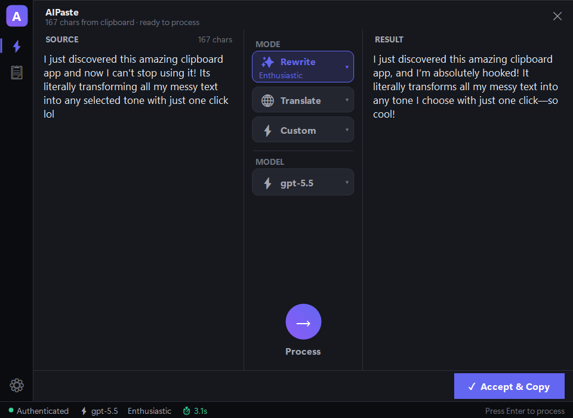
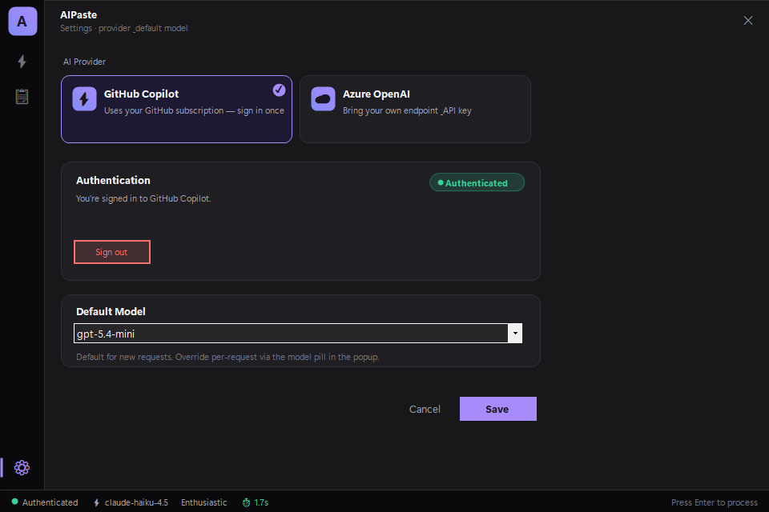
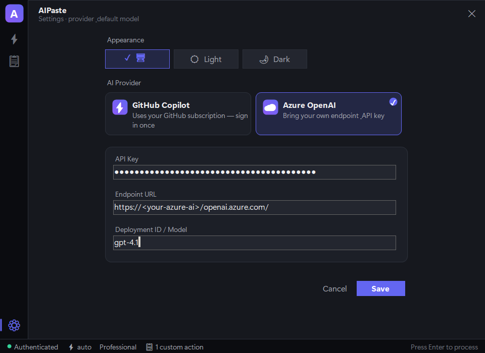
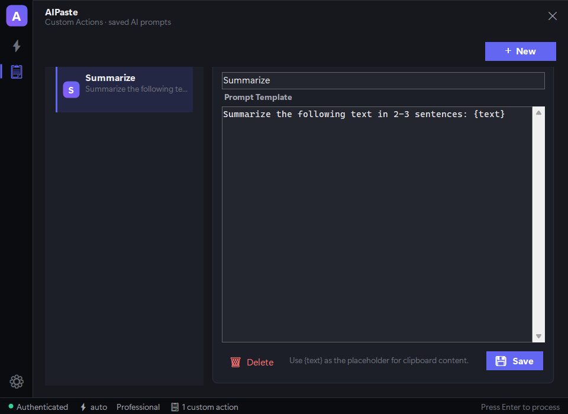

# AIPaste 🚀

A Windows desktop app that **transforms your clipboard with AI**. Keep it running, copy text in any app, return to AIPaste, and rewrite, translate, or run a custom prompt from a polished, keyboard-friendly workspace.


---

## 🆕 What's new in **v2.3.0**

- **Persistent desktop window** – Keep AIPaste open like Outlook or Teams, minimize it to the taskbar, and restore it whenever you need another transform.
- **Automatic clipboard refresh** – Returning to or restoring AIPaste automatically loads the latest copied text into the Source pane.
- **Faster repeated use** – Copilot warms in the background after the UI appears, and client initialization is serialized to prevent competing runtime startups.
- **Isolated transforms** – Every Rewrite, Translate, or Custom request still uses a fresh Copilot session, so previous text never leaks into the next request.
- **Single-instance restore** – Starting `AIPaste.exe` again restores the existing running app instead of creating a duplicate.
- **Smarter installer** – The installer checks for the .NET 9 Desktop Runtime, can install it through winget with confirmation, starts AIPaste, opens its install folder, and keeps its taskbar-pinning guidance visible.

---

## 🆕 What's new in **v2.2.1**

- **Portable zip release** – Releases are normal framework-dependent zip folders, avoiding single-file extraction overhead while keeping updates simple.
- **Installer script** – `scripts\Install-AIPaste.ps1` downloads the release zip, removes the Windows downloaded-file security mark, asks where to install it, and unblocks the extracted files.

---

## 🆕 What's new in **v2.2.0**

- **One-click Copilot login** – A new **Open Copilot to login** button in Settings opens the bundled Copilot CLI and copies `/login` to your clipboard, so signing in is just paste + Enter.
- **Pinned Copilot CLI** – The bundled CLI no longer self-updates (`COPILOT_AUTO_UPDATE=false`), keeping it version-matched to the SDK so sign-in can't break from version drift.
- **Stable config location** – Settings, custom actions and credentials now live in `%APPDATA%\AIPaste\config.json`, so they survive app updates (the portable build previously stored them in a volatile temp folder).
- **Theme switcher** – Choose **System**, **Light**, or **Dark** from Settings → Appearance; the app re-skins instantly.
- **UI fixes** – The tray icon now shows reliably, Settings content is centered with the Save button always visible, and the duplicate timing label / Regenerate button were removed (timing stays in the status bar).

---

## 🆕 What's new in **v2.0.0**

A complete UI redesign and rearchitecture. AIPaste went from a stack of basic WinForms dialogs to a modern app shell with a unified workflow.

| | v1.x | v2.0 |
|---|---|---|
| **Tray menu** | 4 items (Open / Configure / Custom Actions / Exit) | 2 items (Open / Exit) — everything else lives inside the popup |
| **UI style** | Default WinForms gray | Dark theme · purple accent · rounded surfaces · custom-painted controls |
| **Mode picker** | Dropdown | Pill-shaped chip toolbar (Rewrite / Translate / Custom) |
| **Tone & Language** | Dropdowns | Chip rows |
| **Model + Process** | Two separate controls | Single **split-button pill** (model picker + ✨ Process) |
| **Configuration** | Modal dialog window | In-app **Settings** pane (no window switching) |
| **Custom Actions** | Separate window | In-app **Custom Actions** pane with sidebar list + detail editor |
| **Navigation** | Tray right-click | Left **activity rail** (VS Code style) — Process / Custom Actions / Settings |
| **Status** | Hidden | Bottom **status bar** with auth dot, current model, action count, contextual hint |
| **Window** | Standard title bar | **Borderless** with custom dark bar; drag-to-move from top |
| **Keyboard** | Limited | `Esc` to close · `Enter` to process · `Ctrl+1/2/,` to switch panes |

---

## 📸 Screenshots

### Main Window — Process Pane


### Settings — GitHub Copilot


### Settings — Azure OpenAI


### Custom Actions


---

## ✨ Features

- **AI-powered text transforms** – Rewrite, translate, or run custom prompts on any clipboard text
- **Two providers** – GitHub Copilot (CLI auth, bundled) or Azure OpenAI (bring your own endpoint + key)
- **Per-request model picker** – Pick any available model on the fly via the model pill
- **Tone control** – Professional · Casual · Informative · Enthusiastic
- **Translation** – Hindi & Gujarati out of the box (more easy to add)
- **Custom Actions** – Reusable AI prompts with `{text}` placeholder; manage from the in-app pane
- **Streaming output** – AI result appears live, character by character
- **Theme** – System · Light · Dark, switchable in Settings (follows Windows by default)
- **Status bar** – Always-on auth indicator + current model
- **Persistent workspace** – Keep AIPaste running and minimize/restore it from the Windows taskbar
- **Clipboard refresh on activation** – The latest copied text appears automatically when you return to AIPaste
- **Single-instance** – Starting AIPaste again restores the existing app instead of launching a duplicate
- **System tray** – Optional quick access to open or exit the running app

---

## 🔧 Prerequisites

- Windows 10 / 11
- .NET 9.0 Desktop Runtime
- One of the following:
  - **GitHub Copilot** – Active GitHub Copilot subscription (Copilot CLI is bundled with the app)
  - **Azure OpenAI** – Azure subscription with a deployed OpenAI resource

---

## 📥 Installation

### Option 1 — Install Release Zip (recommended)

Run the installer script. It checks for the .NET 9 Desktop Runtime (and offers to install it through winget if needed), downloads the latest `AIPaste-v*.zip` from [Releases](../../releases), asks where to install it, unblocks the extracted files, starts AIPaste, and opens its install folder. The installer waits for you to press **Enter** so its taskbar-pinning guidance remains visible. Press **Enter** at the location prompt to use `%LOCALAPPDATA%\AIPaste`.

```powershell
powershell -ExecutionPolicy Bypass -File .\scripts\Install-AIPaste.ps1
```

Then run `%LOCALAPPDATA%\AIPaste\AIPaste.exe`. Keep the window open or minimized to the taskbar for fast repeated transforms.

Manual install is also supported: download the latest `AIPaste-v*.zip`, right-click it, choose **Properties**, check **Unblock**, extract it to `%LOCALAPPDATA%\AIPaste`, then run `AIPaste.exe`.

### Option 2 — Build from Source

```bash
git clone https://github.com/tannadhruv92/AIPaste.git
cd AIPaste
dotnet build -c Release
```

The build pulls the bundled GitHub Copilot CLI on first compile (~50 MB download).

### Create a Release Zip

```powershell
$version = "2.3.0"
$out = "publish\AIPaste-v$version"
dotnet publish .\AIPaste.csproj -c Release -r win-x64 --self-contained false -p:PublishSingleFile=false -o $out
Compress-Archive -Path "$out\*" -DestinationPath "publish\AIPaste-v$version.zip" -Force
```

Upload `publish\AIPaste-v$version.zip` to the GitHub release. Do not upload `publish\single\AIPaste.exe` for releases.

---

## ⚙️ Configuration

When you first run AIPaste, it'll prompt you to configure a provider. Inside the app window, click the **⚙ Settings** icon at the bottom of the rail.

### Appearance

Choose a theme at the top of **Settings → Appearance**:

- **🖥 System** – follow the Windows light/dark setting (default)
- **☀ Light** – always light
- **🌙 Dark** – always dark

The app re-skins instantly and your choice is saved.

### GitHub Copilot

1. In **Settings**, select the **⚡ GitHub Copilot** card
2. Click **🔓 Open Copilot to login** — this opens the bundled Copilot CLI and copies `/login` to your clipboard
3. In the Copilot terminal, paste (`Ctrl+V`) and press **Enter**, then follow the browser flow
4. Back in AIPaste click **↻ Re-check** — status pill should turn green ✓ Authenticated
5. Choose your **Default Model** and click **Save**

### Azure OpenAI

1. Create an Azure OpenAI resource in the [Azure Portal](https://portal.azure.com)
2. Deploy a model (e.g. `gpt-4o`, `gpt-4`)
3. Note your:
   - **Endpoint** – `https://your-resource.openai.azure.com`
   - **API Key** – Azure Portal → *Keys and Endpoint*
   - **Deployment ID** – Name of your deployed model
4. In AIPaste **Settings**, select the **☁ Azure OpenAI** card
5. Fill in API key, endpoint, and deployment ID, then **Save**

API keys are encrypted with Windows DPAPI before being stored in `config.json` (located at `%APPDATA%\AIPaste\config.json`).

---

## 🚀 Usage

1. **Run** `AIPaste.exe` once and leave it open or minimized
2. **Copy** any text (`Ctrl+C`) from another app
3. **Return to AIPaste** — the Source pane automatically refreshes with the latest clipboard text
4. **Pick a mode** — Rewrite, Translate, or Custom
5. **Tweak controls** — Tone, Language, or Action depending on mode
6. *(Optional)* Click the model name to switch models for this request only
7. **Press Enter** (or click ✨ **Process**) — the result streams into the Result pane
8. **✓ Accept & Copy** — copies the result and minimizes AIPaste so you can paste it into the original app

### Keyboard shortcuts

| Key | Action |
|---|---|
| `Enter` | Run Process (the split button has default focus) |
| `Esc` | Minimize AIPaste |
| `Ctrl+1` | Process pane |
| `Ctrl+2` | Custom Actions pane |
| `Ctrl+,` | Settings pane |

---

## 🎯 Custom Actions

Reusable AI prompts for repetitive tasks. Switch to the **📋 Custom Actions** pane from the rail (or `Ctrl+2`).

1. Click **＋ New Action**
2. Enter a **Name** and a **Prompt Template** — use `{text}` as the placeholder for clipboard content
3. Click **💾 Save**
4. Your action now appears as a chip in **Custom** mode on the Process pane

### Example actions

| Name | Prompt template |
|------|-----------------|
| Fix Grammar | `Fix any grammar and spelling errors in the following text: {text}` |
| Summarize | `Summarize the following text in 2–3 sentences: {text}` |
| Make Bullet Points | `Convert the following text into bullet points: {text}` |
| Explain Simply | `Explain the following in simple terms a 10-year-old would understand: {text}` |
| Email Reply | `Write a professional email reply to: {text}` |

---

## 🏗️ Building from Source

### Requirements

- **.NET 9.0 SDK**
- **Visual Studio 2022** or **VS Code** (with C# Dev Kit)
- Internet access on first build (downloads the bundled Copilot CLI)

### Steps

```bash
git clone https://github.com/tannadhruv92/AIPaste.git
cd AIPaste
dotnet restore
dotnet build -c Release
dotnet run                      # for local testing
```

### Project structure

```
AIPaste/
├── Program.cs                  # Entry point + single-instance pipe
├── MainForm.cs                 # Hidden host form + system tray
├── MainForm.Designer.cs
├── ConfigManager.cs            # Settings persistence (DPAPI-encrypted)
├── CopilotClientManager.cs     # Singleton Copilot SDK client + session pre-warm
├── UI/
│   ├── Theme.cs                # Colours, fonts, metrics
│   ├── GraphicsExt.cs          # Rounded-rect helpers
│   ├── AppShellForm.cs         # Persistent app window + activation clipboard refresh
│   ├── Controls/
│   │   ├── ChipButton.cs       # Pill-shaped chip
│   │   ├── ChipGroup.cs        # Labelled chip row (Mode / Tone / Language / Action)
│   │   ├── SurfaceCard.cs      # Rounded surface container
│   │   ├── SplitActionButton.cs# Model + ✨ Process pill
│   │   ├── ActivityRail.cs     # Left navigation rail
│   │   └── StatusBar.cs        # Bottom ambient status bar
│   └── Panes/
│       ├── ProcessPane.cs      # Default pane — chip toolbar + clipboard + result
│       ├── SettingsPane.cs     # Provider · auth · default model
│       └── CustomActionsPane.cs# List + detail editor for saved prompts
└── config.json                 # User configuration (stored in %APPDATA%\AIPaste)
```

---

## 🔒 Security

- API keys are encrypted with Windows DPAPI (per-user) before persisting to `config.json`
- All data stays local — nothing is sent anywhere except your configured AI provider
- Configuration lives in `%APPDATA%\AIPaste\config.json` (per-user; survives app updates)

---

## 🤝 Contributing

Pull requests welcome! For larger changes please open an issue first.

1. Fork the repo
2. Create a feature branch — `git checkout -b feature/AmazingFeature`
3. Commit — `git commit -m 'Add some AmazingFeature'`
4. Push — `git push origin feature/AmazingFeature`
5. Open a Pull Request

---

## 📄 License

MIT — see [LICENSE](LICENSE).

---

## 🙏 Acknowledgments

- [GitHub Copilot SDK](https://github.com/github/copilot-sdk)
- [Azure.AI.OpenAI](https://www.nuget.org/packages/Azure.AI.OpenAI)

---

Made with ❤️ for clipboard power users.
